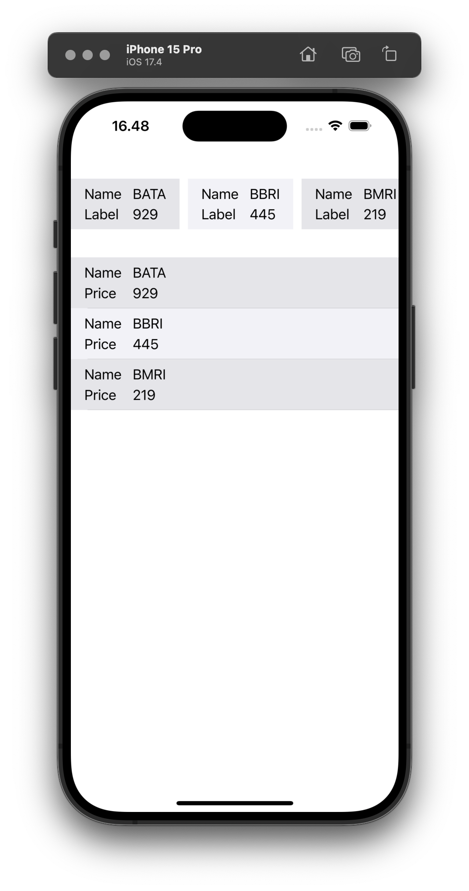

# gRPC Demo
Ini adalah contoh komunikasi stream data dengan menggunakan gRPC.

### Preview
&nbsp;

### Compile proto file
Sebelum dapat menggunakan file proto (`gRPC Demo/Proto/price.proto`), kita harus compile dulu dengan perintah berikut:
```
protoc price.proto \
      --grpc-swift_opt=Client=true,Server=false \
      --grpc-swift_out=. \
      --proto_path=. \
      --swift_opt=Visibility=Public \
      --swift_out=.
```

Jika perintah `protoc` belum ada, kita dapat melakukan instalasi dengan menggunakan perintah:
```
brew install protobuf
```
